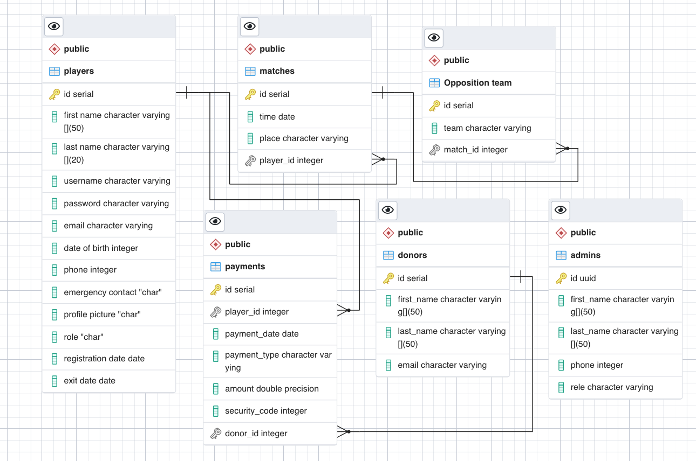

# Cricket Club's Website

### Deployment
Site: ```https://aecc-api.herokuapp.com``` <br>
User Interface: ```https://cricketaecc.herokuapp.com```. Click [Here](https://cricketaecc.herokuapp.com) to access it.

<br>

### Description  
The current focus of the project is to create a desktop web app for the sports club, and the stretch goal is to extend it be accessed on mobile/smart phones as well. The project involves creating an own API as well as using an external one.<br> This Sports club's website is a ```Fullstack RESTful Web App```. The major technologies used in this project are ```NodeJS, ExpressJS, SQL, and PostgreSQL``` for creating an API(backend), along with ```HTML5 and CSS``` for the frontend in combination with a frontend ```JavaScript``` framework called ```ReactJS```. For the deployment of this project, website hosting site named ```Heroku``` is used. <br>

<br>

### User Access/Flow
#### Admin Users: 
- Note: You cannot sign up yourself. One admin user has to create another admin user. You cannot delete yourself. One admin user can delete another admin user.
- Once you are loggedin, you will be directed to home page. Click on the menu bar icon to access more functionalities. 
- - If you click on admins, players, or games in the menu list, You will be shown a button that displays either view admins, view players, or view games. Click on that button, it will render a modal respective to what you wanted to look into. For example, if you click on view admins button, it will render a modal that displays a table containing list of admins. There you will see pencil or trash can icon. If you click on the pencil Icon, you can update your own information. As an admin, you are not allow to update another admin's information. Clicking on trash icon would delete an admin, but you cannot delete yourself. You will also, see new admin button on the top of the table. If you click on that button, it will let you create new admin. Similar approach applies to accessing, creating, and updating games and players.
- Once you log out, the navigation link will change to sign up and log in. But menu icon stays unchanged.

<br>

#### General Users:
- Note: You can sign up to create an account, but this feature is nothing more than that currently.
- Click on Menu Icon at the far right top corner, it opens up the menu list links. Click on any one you want ot explore.
- If you click on Games, it will render a button that says View Games. If you click on it, it will display the game in the tabular form. And the same applies with Admins and Players.

### Tech Stack
Major Technologies: ```NodeJS, ExpressJS, SQL, and PostgreSQL```

<br>

### Entity Relationship Diagram

<br>

### API Endpoints
This project will have an internal API, which means the API in the project will collect the data via user's input. So, the API endpoints will be designed to meet this requirement. The external api for payment processing will be used at the end, and for now, it will be Stripe API.

- Open Postman, then click import and then click on the link option. Copy this url https://documenter.getpostman.com/view/22840735/2s8Z75S9jh and paste it there to create your local working postman end point collections.


<br>

### External Dependencies
User Interface: ```https://cricketaecc.herokuapp.com```. Click [Here](https://cricketaecc.herokuapp.com) to access it.

<br>

### Simulation Steps

<br>

#### 1. Initial Project Setup
- Clone the project ```git clone this project's GitHub Repo url```.
- ```npm install``` -> this installs all the dependencies.

<br>

#### 2. Running Test files
- - jest --coverage to get the code coverage
- -  jest testFile(file name with .js extension)

<br>

#### 3. Running a Seed Data file
- Type ```psql``` in terminal, and hit enter. Then type ```psql<createDB.sql```(psql<your file to create database) to create database, and insert tables into it. 
```createDB.sql``` is a file in this project that creates database and executes seed file.

<br>

#### 4. Running Database in Terminal
- Type ```psql``` in terminal, and hit enter. Then type ```psql<createDB.sql```(psql<your file to create database) to create database, and insert tables into it.
- ```\c your database name``` to connect to that database
- \dt+
- ```select * from name of your relational table;```


